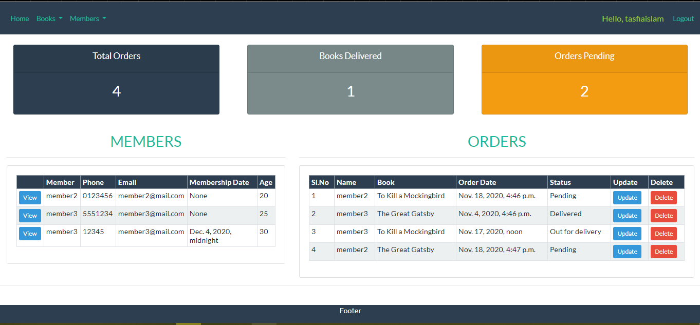
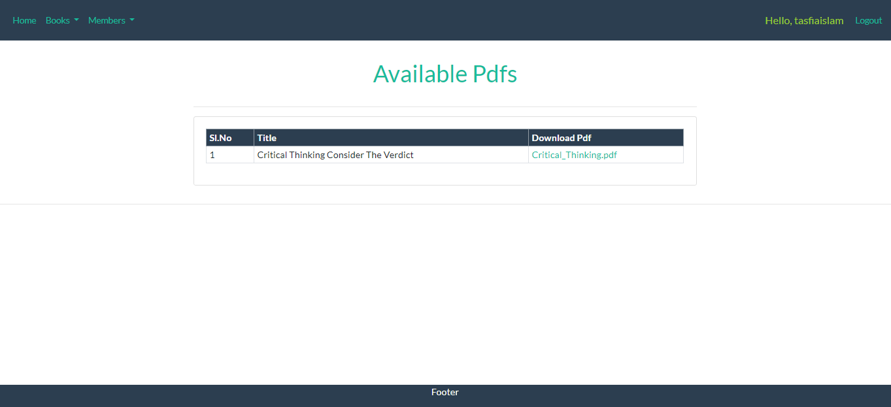

# Library Management System

A functional library manager implemented with Django `3.0.0`

## Getting Started

```bash
$ git clone https://github.com/TasfiaIslam/library-management.git
$ cd library_manager
$ python manage.py migrate
$ python manage.py runserver
```

## Features

- User login,logout, registration
- Role based authorization
- Login authentication
- CRUD Books, Memebers, Orders, Rents
- Upload, Download Pdfs
- Sorting of Orders

## Quick Glance

### Dashboard



### Add Member


### Upload Pdf


### Display and Download Pdf



## Contributing

Feel free to fix bugs, improve things, provide documentation. Just send a pull request.
